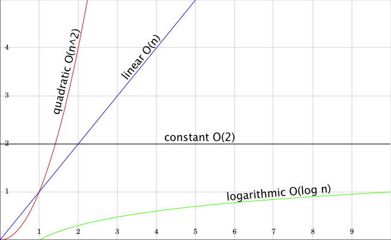
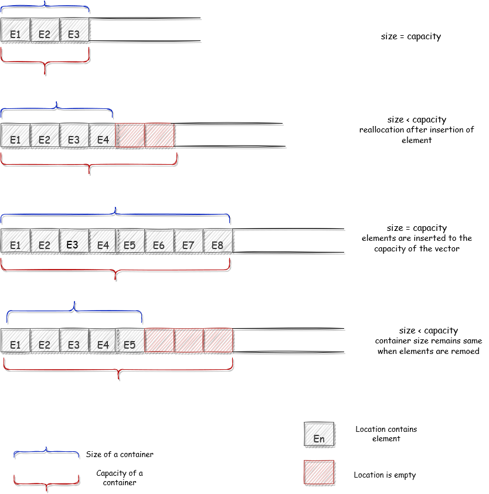
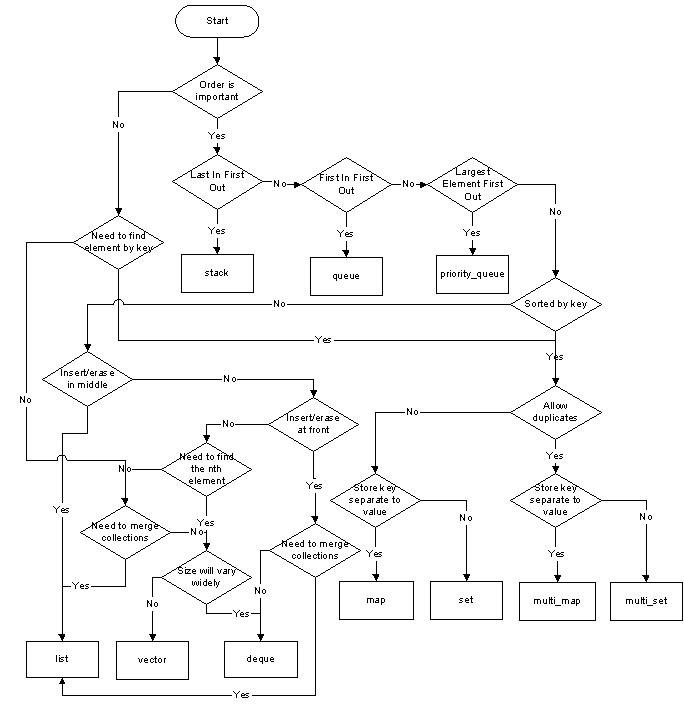

# C++ STL Containers: Choose your containers wisely

The Standard Template Library (STL) is a collection of C++ container classes and template algorithms that work together to produce a variety of useful functionalities. The STL was designed to combine different data structures with different algorithms while achieving the best performance; this guarantees the interoperability between all built-in and user-built components. To benefit from the powerful framework and great performance of the STL, you must know the concepts and apply them carefully.


### Time Complexity and Big-O Notation

There are various solutions to a problem, but not all of them are the best. Generally, we tend to use the most efficient solution. In programming, we can't leave the mechanism of finding the best solution; we need a clear standard to evaluate their efficiency. This is where the notion of time complexity enter the equation.

The Big-O notation describes the runtime of an algorithm and defines the upper bound of any algorithm (i.e, algorithm should not take more than this time). Big-O notation is the most used notation for the time complexity of an algorithm for a given input of size `n`. For example, if the runtime grows linearly with the number of elements `n`, then the complexity is `O(n)` and if the runtime is independent of the input, the complexity is `O(1)`. 

There are different types of time complexities used; the below table lists the typical values of complexity and their Big-O notation.

| Type   |      Notation      |  Description |
|:----------|:-------------|:------|
| Constant |  `O(1)` | The runtime is independent of the number of elements |
| Linear |    `O(n)`  | The runtime grows linearly as the number of elements grows |
| Logarithmic | `O(log(n))` | The runtime grows logarithmically with respect to the number of elements |
| n-log-n | `O(n ∗ log(n))` | The runtime grows as a product of linear and logarithmic complexity |
| Quadratic | `O(n²)` | The runtime grows quadratically with respect to the number of elements |

In the graph, the x axis represents the size of `n` (or algorithm input) and y represents the amount of time it would take to execute that algorithm.



Let’s run through an example to understand better: Finding the sum of the first n numbers.

#### `O(1)` solution

```C++
int findSum(int n) // input "n"
{
    return n * (n+1) / 2; // this will take some constant time c1
}
```
There is only one statement in the preceding code, and we know that a statement takes a constant amount of time to execute. The basic idea is that if the statement takes constant time, it will take the same amount of time regardless of input size, which we denote as `O(1)`. 

#### `O(n)` solution
In this solution, we will run a loop from `1` to `n` and we will add these values to a variable named `sum`.

```C++
int findSum(int n) // input "n"
{
    int sum = 0; // -----------------> it takes some constant time "c1"
    for(int i = 1; i <= n; ++i) // --> here the comparison and increment will take place n times(c2*n) 
        sum = sum + i; // -----------> this statement will be executed n times i.e. c3*n
    return sum; // ------------------> it takes some constant time "c4"
}
/*
* Total time taken = time taken by all the statements to execute
*  i.e, total time taken = c2*n + c3*n + c1 + c4, if the expression c2*n + c3*n constitute to c0*n and another expression c1 + c4 constitute to c then
*  total time taken = c0*n + c, which constitute to O(n) complexity
*/
```
The big O notation of the above code is `O(c0*n) + O(c)`, where `c` and `c0` are constants. So, the overall time complexity can be written as `O(n)`

#### `O(n²)` solution
In this solution, we will increment the value of `sum` variable `i` times i.e. for `i = 1`, the sum variable will be incremented once i.e. `sum = 1`. For `i = 2`, the sum variable will be incremented twice. So, let's see the solution.

```C++
int findSum(int n)  // input "n"
{
    int sum = 0; // ---------------------> constant time c1
    for(int i = 1; i <= n; ++i) 
        for(int j = 1; j <= i; ++j)
            sum++; // -------------------> this will run [(n * (n + 1) / 2)] times
    return sum; // ----------------------> constant time c3
}
/*
* Total time taken = time taken by all the statements to execute
* total time taken = c1 + c2*n² + c2*n + c3
* which constitutes to c2*n² + c2*n + c3
*/
```

The big O notation of the above algorithm is `O(c1*n²) + O(c2*n) + O(c3)`. Since we take the higher order of growth in big O. So, our expression will be reduced to `O(n²)`.

## Containers
A container is an object that stores a collection of elements (i.e. other objects). Each of these containers manages the storage space for their elements and provides access to each element through iterators or member functions. The container library provides standardized interface for member functions; these standardized interface allow containers to be used with STL algorithms.

The C++ containers library categorized as 

- *Sequence containers* - ordered collections in which every element has a certain position.
- *Associative containers* - sorted collections in which the position of an element depends on its key due to a certain sorting criterion
- *Unordered associative containers* - unordered collections in which the position of an element
doesn’t matter.
- *Container Adapter* - provide a different interface for sequential containers

### Sequence Containers

In sequence containers, the position of an element depends on the time and place of the insertion, but it is independent of the value of the element. For example, if you put 5 elements into the a container by appending each element at the end of the actual collection, these elements are in the exact order in which you put them (Hence the name Sequence Containers). The STL contains three predefined sequence container classes: `vector`, `deque`, and `list`. 

#### `std::vector`

The `std::vector` comes into play when array-like storage is needed, but with varying sizes. It uses memory from the heap to store objects and hence is a dynamic array. It enables random access, which means you can  access  each  element  directly  with  the  corresponding  index. Sequence containers are usually implemented as arrays or linked lists

Some Important pointers on `std::vector`

- Appending and removing elements at the end of the array is very fast using `push_back()` and `pop_back()` respectively (`O(1)` in complexity notation).
- However, inserting an element in the middle or at the beginning of the array takes time because all the 
following elements have to be moved to make room for it while maintaining the order (`O(n)` in complexity notation for `n` vector elements).
- Vector reallocation occurs when vector size increases beyond its current storage capacity, it will automatically move all items to a larger chunk of newly allocated memory and delete the old chunk.
- In such cases. iterators or references that point at altered portions of the sequence become invalid.

##### Size and capacity of the container

`size` is a the number of elements up to the highest-indexed one you have used; whereas `capacity` is  the number of elements the vector can hold before reallocating.




The  following  example  defines  a  vector  for  integer  values,  inserts  six  elements,  and  prints  the elements of the vector:

```C++
#include <iostream>
#include <vector>  // header for vector

int main()
{
    std::vector<int> vec; //vector container for integer elements

    // append elements with values 1 to 6
    for (int i = 1; i <= 6; ++i)
    {
        vec.push_back(i);
    }

    //print all elements followed by a space
    for (const auto &ele : vec)
    {
        std::cout << ele << ' ';
    }
    std::cout << std::endl;
}
```

>**_NOTE:_** STL containers provide only those special member functions that in general have good performance, where "good" normally means constant or logarithmic complexity. This prevents a programmer from calling a function that might cause bad performance.

#### `std::deque`
Deque is an abbreviation for double ended queue. it  is  a  dynamic array that is implemented so that it can grow in both directions.

Some Important pointers on `std::deque`

-  Inserting elements at the end and at the beginning is fast (`O(1)` in complexity notation).
-  However, inserting elements in the middle takes time because elements must be moved (`O(n)` in complexity notation for `n` deque elements).
-  If an element is inserted into an empty sequence, or if an element is erased to leave an empty sequence, then iterators earlier returned by `begin()` and `end()` become invalid.
-    If an element is inserted at the first position of the deque, then all iterators that designate existing elements become invalid. 

-    If an element is inserted at the end of the deque, then `end()` and all iterators that designate existing elements become invalid.

- Allocating `deque` contents from the center of the underlying array, and resizing the underlying array when either end is reached leads to frequent resizing and waste more space, particularly when elements are only inserted at one end.

It is important to note that, `deque` allocator allocates block of memory in a single allocation and hence frequent `push_back()` or `push_front()` has less memory allocation overhead compared to vector. In vector the memory is allocated in smaller chunks, hence frequent insertion of elements leads to frequent allocation of memory, slowing down the container.

The following general `deque` example declares a `deque` for floating-point values:

```C++
#include <iostream>
#include <deque>

int main()
{
    std::deque<float> dq; //deque container for floating-point elements
                          
    for (int i = 1; i <= 6; ++i)
    {
        dq.push_front(i * 2.2); //insert at the front
    }

    //print all elements followed by a space
    for (const auto &ele : dq)
    {
        std::cout << ele << ' ';
    }
    std::cout << std::endl;
}
```

#### `std::list`

A `list` is implemented as a doubly linked list of elements. This means each element in a list has its own segment of memory and refers to its predecessor and its successor. 

Some Important pointers on `std::list`

- Unlike `vector`s and `deque`s, fast random access to `list` elements is not supported, to access the tenth element, you must navigate the first nine elements by following the chain of their links (`O(n)` complexity because the average distance is proportional to the number of elements).
- `list` supports bidirectional iterators and allows constant time `insert` and `erase` operations  anywhere  within  the  sequence,  with  storage  management  handled  automatically.` (`O(1)` complexity).
- If only uni-directional list traversal is needed, `std::forward_list` may be more performant in both space and maintenance complexity, because it maintains only list item pointers in one direction.

Example:

```C++
#include <algorithm>
#include <iostream>
#include <list>

int main()
{
    // Create a list containing integers
    std::list<int> l = {17, 55, 16, 3};

    // Insert an integer before 16 by searching
    auto it = std::find(l.begin(), l.end(), 16);
    if (it != l.end())
    {
        l.insert(it, 77);
    }

    //print all elements followed by a space
    for (const auto &ele : l)
    {
        std::cout << ele << ' ';
    }
    std::cout << std::endl;
}

/*OUTPUT
17 55 77 16 3
*/
```
### Associative containers

Associative container can be considered a special kind of sequence container because sorted collections are ordered according to a sorting criterion. The automatic sorting of elements in associative containers does not mean that those containers are especially designed for sorting elements. The key advantage of automatic sorting is better performance when you search elements. In particular, you can always use a binary search, which results in logarithmic complexity rather than linear complexity. 

An associative container is a variable-sized container that supports efficient retrieval of elements  (values) based on keys. It supports insertion and removal of elements, but differs from a sequence in that it does not provide a mechanism for inserting an element at a specific position. The STL contains four predefined associative container classes: `set`, `multiset`, `map`, `multimap`.
 
#### `std::set`
A  set  is  a  collection  in  which  elements  are  sorted  according  to  their  own  values.  Each element may occur only once, thus duplicates are not allowed. 

Some pointers on `std::set`
- Insert and erase is `O(log n)` complexity.
- Initialize with unsorted sequence is `O(n log n)` complexity.
- Initialize with sorted sequence is `O(n)` complexity.
- `lower_bound` and `upper_bound` can be used with `set`.

>**_NOTE:_** `lower_bound(st.begin(), st.end(), x)` will compile but is `O(n)` for `std::set`

Example:

```C++
#include <iostream>
#include <set>

int main()
{
    std::set<int> st; //set container for int values

    /** insert elements in arbitrary order 
        *  value 1 gets inserted twice 
        */
    st.insert(8);
    st.insert(1);
    st.insert(5);
    st.insert(7);
    st.insert(1);
    st.insert(6);
    st.insert(11);

    // print all elements
    for (const auto &ele : st)
    {
        std::cout << ele << ' ';
    }
    std::cout << std::endl;
}

/*OUTPUT
1 5 6 7 8 11
*/
```
#### `std::multiset`
A  multiset  is  the  same  as  a  set  except  that  duplicates  are  allowed.  Thus,  a  multiset  
may contain multiple elements that have the same value.

- The time complexity of `count()` is additionally linear (`O(n)`) to the number of elements having the key. 

Example:

```C++
#include <iostream>
#include <set>

int main()
{
    std::multiset<int> st; //multiset container for int values

    /** insert elements in arbitrary order 
        *  value 1 gets inserted twice 
        */
    st.insert(8);
    st.insert(1);
    st.insert(5);
    st.insert(7);
    st.insert(1);
    st.insert(6);
    st.insert(11);

    // print all elements
    for (const auto &ele : st)
    {
        std::cout << ele << ' ';
    }
    std::cout << std::endl;
}

// A multiset allows duplicates, so it would contain two elements that have value 1

/* OUTPUT
1 1 5 6 7 8 11
*/
```

#### `std::map`
A  map  contains  elements  that  are  key/value  pairs.  Each  element  has  a  key  that  is  the  basis for the sorting criterion and a value. Each key may occur only once, thus duplicate keys are not allowed. A map can also be used as an associative array, which is an array that has an arbitrary index type.

Some important pointers on `std::map`
- Since `multiset` `count()` could be slow, we can use map to store the frequency of a key instead of inserting multiple copies of they same key into a multiset .
- Insertion, deletion and lookup has logarithmic complexity `O(log n)`, when `n` is the number of entries.
- If the index operator is called with a non-existing number, it stores this number in the map and uses the default constructor for generating the data. This ensures that the index operator never returns an invalid reference.
- In order to prevent above case, `find()` should be called beforehand.

Example:

```C++
#include <iostream>
#include <map>
#include <string>

int main()
{

    std::map<int, std::string> mp; //set container for int/string values

    //insert some elements in arbitrary order
    // a value with key 1 gets inserted twice
    mp.insert(std::make_pair(5, "map")); 

    /** 
     *  The  elements are key/value pairs, so you must create such a pair to insert it into the
     *  collection. The auxiliary function make_pair() is provided for this purpose.
     */
    mp.insert(std::make_pair(2, "is a"));
    mp.insert(std::make_pair(1, "sorted"));
    mp.insert(std::make_pair(4, "associative"));
    mp.insert(std::make_pair(6, "container"));
    mp.insert(std::make_pair(1, "key"));
    mp.insert(std::make_pair(3, "value"));

    // print key value pairs
    for (const auto &ele : mp)
    {
        /**
         * you must access the members of the pair structure, which are called first and second
         */
        std::cout << ele.first << " : " << ele.second << std::endl;  
    }
}

/*OUTPUT
1 : sorted
2 : is a
3 : value
4 : associative
5 : map
6 : container
*/
```

### `std::multimap`
`multimap` differs from `map` in the same way as `multiset` differs from `set`: multiple entries of elements with identical keys are possible.

Example:

```C++
#include <iostream>
#include <map>
#include <string>

int main()
{

    std::multimap<int, std::string> mp; //set container for int/string values

    //insert some elements in arbitrary order
    // a value with key 1 gets inserted twice
    mp.insert(std::make_pair(5, "map"));
    mp.insert(std::make_pair(2, "is a"));
    mp.insert(std::make_pair(1, "sorted"));
    mp.insert(std::make_pair(4, "associative"));
    mp.insert(std::make_pair(6, "container"));
    mp.insert(std::make_pair(1, "key"));
    mp.insert(std::make_pair(3, "value"));

    // print key value pairs
    for (const auto &ele : mp)
    {
        std::cout << ele.first << " : " << ele.second << std::endl;
    }
}

/*OUTPUT
1 : sorted
1 : key
2 : is a
3 : value
4 : associative
5 : map
6 : container
*/
```

#### Custom compare for associative containers
Container have a predefined comparison function, Sometimes we may want to supply alternative comparison function. The complete declaration for `std::set` is

```C++
template <class T, class Compare = less<T>, class Alloc = allocator<T> > 
class set;
```
Where,
- `T` is the type of elements that will be held
- `Alloc` is the memory allocator, with the default being `allocator<T>`
- Compare is the type of the comparison used, with the default being `std::less<T>`

we can provide our desired comparison function object for the template parameter.

```C++
#include <iostream>
#include <set>

template <typename T>
int printContainer(T con)
{
    for (const auto &ele : con)
    {
        std::cout << ele << ' ';
    }
    std::cout << std::endl;
}

int main()
{
    auto comp = [](int a, int b)
    { return a > b; };

    std::initializer_list<int> lst{34, 45, 1, 77, 98, 15};

    std::set<int> st(lst);                        // default std::less<int>
    std::set<int, std::greater<int>> st1(lst);    // changed compare to std::greater<int>
    std::set<int, decltype(comp)> st2(lst, comp); // custom compare same as std::greater<int>

    std::cout << "With default std::less<int>: ";
    printContainer(st);

    std::cout << "With std::greater<int>: ";
    printContainer(st1);

    std::cout << "With custom compare comp: ";
    printContainer(st2);

    return EXIT_SUCCESS;
}

/*OUTPUT
With default std::less<int>: 1 15 34 45 77 98 
With std::greater<int>: 98 77 45 34 15 1 
With custom compare comp: 98 77 45 34 15 1
*/
```

### Unordered associative containers
Binary search tree is not the only way of implementing associative containers. With hash tables, items can be found in `O(1)` time. The `size` of the hash table can be manipulated by the user, and the hash function can also be chosen individually, which is important, because the performance versus space consumption characteristics depend on that.

Some important pointers

- These containers has Hash table implementation
- Since elements  are unordered,  you cannot perform binary search
- Also, `begin()` does not return  the smallest element
- In order to use `unordered_set/map`, classes must have hash function implemented

Example:

```C++
struct hasher
{
    size_t operator()(std::pair<int, int> x) const
    {
        return x.first ^ x.second;
    }
};

int main()
{
    std::unordered_set<std::pair<int, int>, hasher> us;

    us.insert({5, 2});
    us.insert({6, 1});
    us.insert({1, 7});
    us.insert({4, 9});
    us.insert({0, 6});

    std::cout << us.bucket_size(6) << std::endl; // prints 2 becz there are 2 containers with hash code 6
    return EXIT_SUCCESS;  
}
```

Alternatively, you can implement a stronger hash function that produces different, unpredictable hashes for the same number across runs.

### Adapter Containers
Container adapters are a special type of container class. They are not full container classes on their own, but wrappers around other container types (such as a vector, deque, or list). These container adapters encapsulate the underlying container type and limit the user interfaces accordingly.

- There are three standard container adapters: stacks, queues, and priority queues.
- Constructor adapters allow you to pass a specific allocator to their constructors.
- Container adapters provide the `emplace()` feature, which internally creates a new element initialized
by the passed arguments

#### `std::stack`

A `stack` is a container which allows insertion, retrieving, and deletion only at one end (LIFO data structure). Objects inserted first are removed last. Any one of the sequence container could be used as a `stack`, if those containers supports the following operation.
- Insertion at one end (push, with `push_back()`).
- Deletion from the same end (pop, with `pop_back()`).
- Retrieving the value at that end (top, with `back()`).
- Testing the `stack` being empty (with `empty()`).

The `std::stack<T>` is a `stack` of `T` with a default implementation using a `deque`.

Example:

```C++
int main()
{
    std::stack<int> s;
    s.push(10);
    s.push(20);
    s.push(30);
    s.push(40);
    s.push(50);

    std::cout << "Size: " << s.size() << std::endl; 
    std::cout << "Top: " << s.top() << std::endl; 

    std::cout << "Elements of stack: ";

    while(!s.empty())
    {
        std::cout << s.top() << ' ';
        s.pop();
    }
    std::cout << std::endl;

    return EXIT_SUCCESS;   
}

/*OUTPUT
Size: 5
Top: 50
Elements of stack: 50 40 30 20 10
*/
```


#### `std::queue`

A queue allows you to insert objects at one end and to remove them from the opposite end (FIFO data structure). The objects at both ends of the queue can be read without being removed.

- `list` and `deque` are suitable data types for `queue` implementation.
- The `std::queue<T>` is a `queue` of `T` with a default implementation using a `list`.
- `push()` inserts any number f elements.
- `pop()` removes the elements in the same order in which they are inserted.
- `front()` returns the first element in the queue.
- `back()` returns the last element in the queue.

Example:

```C++
int main()
{
    std::queue<int> q;
    q.push(10);
    q.push(20);
    q.push(30);
    q.push(40);
    q.push(50);

    std::cout << "Size: " << q.size() << std::endl; 
    std::cout << "Front: " << q.front() << std::endl; 
    std::cout << "Back: " << q.back() << std::endl; 

    std::cout << "Elements of queue: ";

    while(!q.empty())
    {
        std::cout << q.front() << ' ';
        q.pop();
    }
    std::cout << std::endl;

    return EXIT_SUCCESS;   
}

/*OUTPUT
Size: 5
Front: 10
Back: 50
Elements of queue: 10 20 30 40 50
*/
```

#### `std::priority_queue`
A priority queue always returns the element with the highest priority. The priority criterion must be specified when creating the queue. In the simplest case, it is the greatest (or smallest) number in the queue. We can also write our own custom compare to describe the priority of an element in the queue (default compare is `std::less<int>`).

Example:

```C++
int main()
{
    std::priority_queue<int, std::vector<int>, std::greater<int>> pq;
    pq.push(10);
    pq.push(20);
    pq.push(30);
    pq.push(40);
    pq.push(50);

    std::cout << "Size: " << pq.size() << std::endl;
    std::cout << "Top: " << pq.top() << std::endl;

    std::cout << "Elements of queue: ";

    while (!pq.empty())
    {
        std::cout << pq.top() << ' ';
        pq.pop();
    }
    std::cout << std::endl;

    // using lambda to compare elements.
    auto compare = [](int a, int b)
    {
        return a < b;
    };

    std::priority_queue<int, std::vector<int>, decltype(compare)> q(compare);

    for (int n : {1, 8, 5, 6, 3, 4, 0, 9, 7, 2})
        q.push(n);

    std::cout << "Elements of queue for custom compare: ";

    while (!q.empty())
    {
        std::cout << q.top() << ' ';
        q.pop();
    }
    std::cout << std::endl;
    return EXIT_SUCCESS;
}

/*OUTPUT
Size: 5
Top: 10
Elements of queue: 10 20 30 40 50 
Elements of queue for custom compare: 9 8 7 6 5 4 3 2 1 0
*/
```

### Choose your containers wisely.



- Do you need to be able to insert a new element at an arbitrary position  in  the container? - if so, you need a sequence containers.

- Do  you  care  how  elements  are  ordered  in  the  container? - if not, hashed containers becomes workable choice, otherwise use ordered containers.

- Do you need to avoid movement of existing containers elements when insertions and erasures take place? - Avoid using contiguous containers

- Does you code has frequent `push_back()`? - use `deque` instead of `vector` as `deque` allocates block of data.

- If there are strict requirements on memory usage, additional memory overhead for storing hash table cannot be accepted.

- If you are to traverse the map use ordered map instead of unordered map.

- If the size is immutable choose `std::array` instead of `vector`.

- If there are frequent insertion and remove of the elements in the middle of the sequence- use `std::list` instead of vector and deque.


In some use cases the containers in STL are not a great fit, in that case we can write our own containers. With the implementation of some basic core interfaces we can use adaptor interface efficiently.


